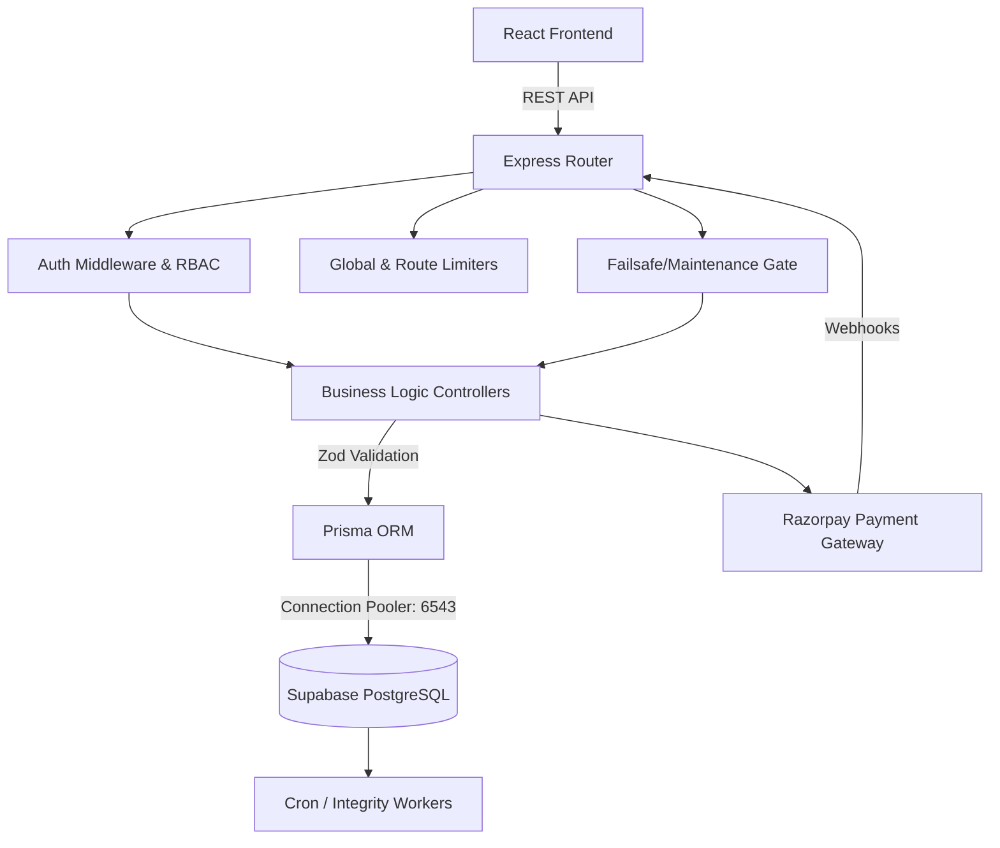

# ZivoHotels - Production Architecture Blueprint

> [!NOTE]
> **Stack Clarification**: While your prompt mentioned Next.js and PDF engines, this blueprint reflects the **actual** codebase of ZivoHotels, which is built on a high-performance **Vite + React 18** frontend, an **Express.js + Prisma** backend, and PostgreSQL. It focuses heavily on hospitality domain logic (inventory, pricing, bookings, RBAC) rather than document processing.

## 1. Executive System Overview

ZivoHotels is a multi-tenant, enterprise-grade Property Management System (PMS) and OTA booking engine. 

### Technology Stack
- **Frontend**: React 18, Vite, React Router DOM, Tailwind CSS v3.4, Lucide Icons, react-day-picker.
- **Backend**: Node.js, Express.js, Prisma ORM (v5+), Zod (schema validation), JWT, bcryptjs.
- **Database**: PostgreSQL (hosted on Supabase) utilizing connection pooling (`pgbouncer`) and `pg_trgm` for fuzzy search.
- **Payments**: Razorpay Integration (Orders API + Webhooks).
- **Deployment Strategy**: Frontend on Vercel/Netlify; Backend on Node environment; DB on Supabase (Pro Tier recommended for concurrency).

---

## 2. Core Architectural Flow

---

## 3. Database Architecture (Prisma Schema)

The database is highly relational, designed to support flexible pricing and multi-tenant isolation.

### Core Entities & Relationships
- **User**: Handles Auth & RBAC (`ADMIN`, `OWNER`, `CUSTOMER`). Has `tokenVersion` for immediate session revocation.
- **Hotel**: The primary property entity. Has a 1:M relationship with RoomTypes, Images, Agreements, and BankDetails.
- **RoomType**: Defines capacity, base occupancy, and extra beds. Has a 1:M relationship with RatePlans and Inventory.
- **RatePlan**: The core of the pricing engine. Connects to `OccupancyPricing` for per-head dynamic scaling (e.g., Base price for 2 guests, +₹500 for the 3rd).
- **Inventory**: Tracks `totalRooms`, `bookedRooms`, and `availableRooms` on a per-date, per-RoomType basis.
- **Booking**: Central transaction record. Links User, Hotel, RoomType, RatePlan, and tracks payment status, refund history, and cancellation policies.

> [!IMPORTANT]
> **Data Integrity Guard**: A strict payload normalization engine (`normalizeHotelPayload`) exists between the client and Prisma to strip extraneous JSON metadata, preventing 500 fatal ORM crashes.

---

## 4. Backend Ecosystem (Express Services)

### Key Controllers
1. **`authController.js`**: Handles login/signup, JWT issuance, and global logout (via `tokenVersion` increment).
2. **`hotelController.js`**: Handles property CRUD. Features a strict sanitation pipeline to prevent Prisma `ValidationError` crashes. Implements `pg_trgm` search logic.
3. **`bookingController.js`**: The most critical engine. Uses **Atomic Row-Level Locking (`FOR UPDATE`)** during inventory checks to prevent double-booking. Handles the cancellation state machine.
4. **`paymentController.js`**: Connects to Razorpay. Handles `payment.captured`, `payment.failed`, and `payment.refunded` webhooks. Uses crypto SHA256 signature verification.
5. **`integrityWorker.js`**: Background worker to sweep for expired/abandoned pending bookings and restore locked inventory.

### Security & Middleware
- **`authMiddleware.js`**: Checks JWT validity, verifies `tokenVersion`, and enforces RBAC (`authorizeRoles`).
- **`maintenanceMiddleware.js`**: A global "Kill Switch" reading from `SystemConfig`. Can disable bookings or payments system-wide without code deployment.
- **Rate Limiting**: Custom limiters for Search (50/min), Booking (5/min), and Auth (10/15min) to prevent abuse and DDoS.

---

## 5. Frontend Architecture

### Structure
- **`/pages`**: Public and Customer routes (`Home`, `Listing`, `Detail`, `Checkout`, `MyBookings`).
- **`/admin/pages`**: Secured routes for Owners and Admins (`Dashboard`, `Bookings`, `PropertyWizard`, `InventoryPricing`).
- **`/services/api.js`**: Centralized Axios/Fetch wrapper. Includes a **Global 401 Interceptor** that automatically logs out users if their JWT expires or is revoked.
- **`/context/AuthContext.jsx`**: Global state provider for user sessions.

### UX Flows & State
- **Search Engine**: Features an adaptive guided flow (Destination -> Dates -> Guests) to maximize mobile conversion. Uses `react-day-picker`.
- **Property Wizard**: A 16-step modular onboarding flow for Owners.
- **Checkout Sync**: The frontend pulls the exact `RatePlan` pricing to match the search results, preventing OTA price drift.

---

## 6. Financial & Pricing Engine

The pricing architecture is OTA-grade (Online Travel Agency), moving away from flat "base prices" to dynamic Rate Plans.

1. **Occupancy Scaling**: 
   - A room costs ₹2000 for 2 guests.
   - If a 3rd guest is added, the engine queries `OccupancyPricing` and adds the exact differential (e.g., +₹800).
2. **Tax (GST) Engine**:
   - Taxes are calculated *atomically* on the post-discount nightly tariff, complying with Indian GST slabs.
3. **Refund Logic**:
   - `refundCalculator.js` evaluates the check-in window. 
   - >24h = Full Refund. 6h-24h = Partial. <6h = No Refund. 
   - Webhooks handle "late captures" (where a user pays after the booking expired) by triggering auto-refunds.

---

## 7. Scalability & Failure Handling

> [!CAUTION]
> **Inventory Concurrency Risk**: The highest risk in any PMS is double-booking the last available room.

**How ZivoHotels mitigates this:**
1. **Database Locking**: When `createBooking` is called, Prisma wraps the inventory check in a `$transaction`. It reads the inventory rows using raw SQL `SELECT ... FOR UPDATE`. This locks the row in PostgreSQL until the transaction commits, queuing parallel requests.
2. **Webhook Idempotency**: Razorpay webhooks can occasionally fire twice. The `paymentController` strictly checks the current `paymentStatus` before issuing updates to prevent double-crediting or double-refunding.
3. **Failsafe Drift Reconciliation**: A planned cron job `Inventory = TotalRooms - ActiveBookings` will run nightly to ensure no ghost locks exist if the Node server crashes mid-transaction.

---

## 8. Deployment Configuration Checklist

When migrating from staging to production, follow this exact configuration:

1. **Supabase Optimization**: 
   - Switch connection string to use the Transactional Pooler (port `6543` with `?pgbouncer=true`).
   - Upgrade to Pro Tier to prevent Serverless Cold Starts (>3s latency causes 40% user drop-off).
2. **Environment Variables**:
   - Ensure `NODE_ENV=production`.
   - Update `RAZORPAY_KEY_ID` and `SECRET` from test mode to live mode.
   - Rotate `JWT_SECRET`.
3. **Observability**:
   - Attach Sentry or NewRelic to the Node.js process to monitor `calculateFiscalData` crashes and webhook failures.

---

## 9. Admin Console & Role-Based Access Control (RBAC)

The ZivoHotels Admin Console is a comprehensive, secured portal designed for both global system administrators and individual property owners.

### Role-Based Access Control (RBAC)
- **`ADMIN` (Super Admin)**: Has global read/write access to all properties, users, bookings, and system configurations. Can access the `SystemControlCenter` and manage global platform taxation rules.
- **`OWNER` (Property Partner)**: Access is strictly scoped to properties they own (`ownerId === req.user.id`). They can manage their own inventory, rate plans, and view specific bookings/analytics, but cannot access global system settings.
- **`CUSTOMER`**: Restricted to public APIs and self-service portals (e.g., `MyBookings`).

### Core Admin Modules
1. **Property Management (Property Wizard)**: A 16-step modular engine that handles property onboarding, media library management, amenities, policies, and commercials.
2. **Inventory & Pricing Engine**: A complex grid interface allowing Owners/Admins to configure `RoomTypes` and dynamic `RatePlans` (EP, CP, MAP, AP). It supports occupancy-based pricing overrides and extra bed calculations.
3. **Bookings & Cancellation Desk**: A unified table (`Bookings.jsx`) that allows operators to view the entire booking lifecycle, force-cancel reservations, and trigger automated Razorpay refunds.
4. **Metrics & Analytics Dashboard**:
   - Fetches real-time KPIs (Total Revenue, Active Bookings, Occupancy Rate).
   - Generates visual charts for Revenue Trends and Booking Volume.
   - Highlights Top Performing Properties.
5. **System Control Center (Admin Only)**:
   - Houses the Global Kill Switches (`maintenanceMode`, `isBookingDisabled`, `isPaymentDisabled`).
   - Allows configuration of partial payment percentages and prepaid discounts.
   - Provides access to security logs and automated system integrity scans.

---
*Generated by Antigravity AI Engineering - Architecture mapped from current codebase state.*
